# Magos Vs. Slimes
### UTN - Facultad Regional Buenos Aires - Materia Paradigmas de Programación

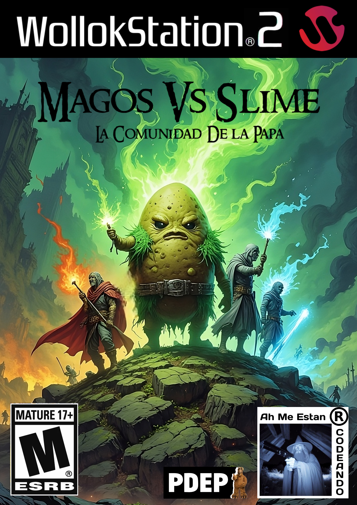

### Trailer

[Probar sin descargar (Version desactualizada)](https://www.wollok.org/concurso/2024-o-tpjuego-ahmeestancodeando/)

Magos vs Slimes es un emocionante videojuego de estrategia y defensa en el que los jugadores deben proteger la última ciudad de la humanidad, Utopía de las Tierras de Nortfernand (UTN), de interminables oleadas de Slimes. Con una variada selección de Magos, cada uno con habilidades y poderes únicos, tendrás que impedir que los Slimes alcancen las puertas de la ciudad. Si tres o más logran atravesar tus defensas, el juego llegará a su fin y la humanidad perecerá...

¡Prepárate para la batalla y salva a la UTN del caos!

## Magos
Cada Mago tiene una función específica, como disparar proyectiles, bloquear el avance de los zombis, explotar causando daño, entre otros. Los Magos requieren Dinero para poder ser contratados, este dinero se genera automáticamente a lo largo de la partida.

  <table>
    <tr>
      <td align="center">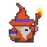 Daño: 🔥🔥 Vida: ❤️ Dispara</td>
      <td align="center">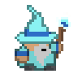 Daño: ❄️❄️❄️ Vida: 💙 Dispara</td>
      <td align="center">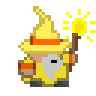 Daño: 🤑 Vida: 💚 Genera Dinero</td>
      <td align="center">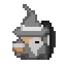 Daño: ☮️ Vida: 🗿🗿🗿 Protección</td>
      <td align="center">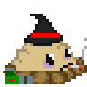 Daño: 💣💣💣 Vida: ☠️☠️☠️ Explota</td>
      <td align="center">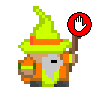 Daño: 🤚 Vida: ❤️ Dispara</td>
    </tr>
  </table>

## Proyectiles
Cada tipo de Proyectil tiene daño o efecto propio. Los proyectiles se pueden fusionar dando lugar a versiones más poderosas.

  <table>
    <tr>
      <td align="center"> Daño: 🔥🔥</td>
      <td align="center">➡️</td>
      <td align="center">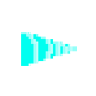 Daño: ❄️❄️❄️</td>
      <td align="center">➡️</td>
      <td align="center">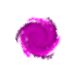 Daño: 🟣🟣🟣🟣</td>
    </tr>
    <tr> Al juntarse dos proyectiles identicos se convierte en uno mejor </tr>
    <tr>
      <td align="center" colspan="5">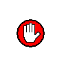 Daño: 🤚 Ralentiza enemigos</td>
    </tr>
  </table>

## Slimes
Los distintos Slimes tienen características propias: más vida, más daño, movimientos especiales, entre otras cosas. Atacan en oleadas desde el extremo derecho del tablero e intentan llegar a la base de los magos (extremo izquierdo del tablero).

  <table>
    <tr>
      <td align="center">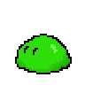 Daño: 🟢 Vida: 💚💚  - </td>
      <td align="center">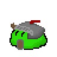 Daño: 🟢 Vida: 💚💚💚  Tiene mas vida</td>
      <td align="center">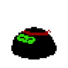 Daño: 🥷🥷🥷 Vida: 💚💚  Se mueve de a dos celdas </td>
      <td align="center">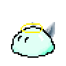 Daño: 🛐🛐🛐 Vida: 🛐🛐🛐  Mucha vida y daño </td>
    </tr>
    <tr>
      <td align="center">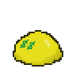 Daño: - Vida: 💚💚💚  Da dinero al morir </td>
      <td align="center">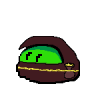 Daño: 🟢 Vida: 💚💚  Roba dinero </td>
      <td align="center">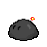 Daño: 💣💣💣 Vida: 💚💚💚  Explota </td>
      <td align="center">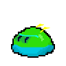 Daño: 🟢 Vida: 💚💚💚  Se mueve de fila </td>
    </tr>
  </table>

## Modos de Juego

**Historia:** Enfrentar diversos niveles con cambios en tipos y dificultad de oleadas.

**Eterno:** Modo desafiante en el que se enfrentan oleadas interminables y aleatorias de Slimes, con dificultad creciente.

## Controles:

- `A` para ir a la izquierda en la tienda
- `D` para ir a la derecha en la tienda
- `ARROW_UP` para mover arriba cursor
- `ARROW_LEFT` para mover izquierda cursor
- `ARROW_RIGHT` para mover derecha cursor
- `ARROW_DOWN` para mover abajo cursor
- `ENTER` para poner planta / utilizar pala
- `P` para reiniciar juego
- `I` termina el juego
- `O` para pausar juego
- `X` Ir al Menú Principal

## Equipo de desarrollo:

- Echeverría, Manuel
- Marek, Nahuel
- Marzocca, Damián
- Schkurko, Nicolás
- Vallone, Matías

## Capturas

## Como está hecho

[Acceso a teórica](https://github.com/pdepjm/2024-o-tpjuego-ahmeestancodeando/blob/concurso/Teorica.md)

## Links relevantes

- [Probar sin descargar (Version desactualizada))](https://www.wollok.org/concurso/2024-o-tpjuego-ahmeestancodeando/)
- [Link al Lore](https://docs.google.com/document/d/1lBfEKnoyl5uwRfzc_BIOiNtRY3-iJxHwnHqUtpygSzU/edit?tab=t.0)
- [Link al Trailer](https://youtu.be/0D9ru_qJyPM?si=un1xRSzEtPHEvkAe)

## Updates
> 09-12-24 1.01v: Animaciones disparo, mejoras rendimiento, mejoras sonido, balanceo general

