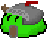
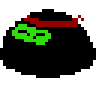

#  Magos Vs. Slimes
UTN - Facultad Regional Buenos Aires - Materia Paradigmas de Programación

## Equipo de desarrollo: 

- Echeverría, Manuel
- Marek, Nahuel
- Marzocca, Damián
- Schkurko, Nicolas
- Vallone, Matías
 

## Capturas 

## Magos

                
  
 <pre>Daño:🔥     Daño:❄️❄️     Daño:🤑      Daño:☮️     Daño:💣💣💣 </pre>  

 <pre>Vida:❤️     Vida:💙      Vida:💚    Vida:🗿🗿🗿    Vida:☠️☠️☠️ </pre>  

## Proyectiles

         

## Slimes

         

 <pre>Daño:🟢      Daño:🟢     Daño:🥷🥷🥷    Daño:🛐🛐🛐    </pre>  

 <pre>Vida:💚💚   Vida:💚💚💚   Vida:💚       Vida:🛐🛐🛐    </pre>  

## Reglas de Juego / Instrucciones
En Nuestra mision es defender la EL ULTIMO FARO DE LA HUMANIDAD, la ciudad de "Utopía de las Tierras de Nortfernand (UTN)", de los slimes, evitando que lleguen 3 o más de ellos a nuestras puertas. Para protegernos, contaremos con la ayuda de magos, cada uno con habilidades únicas, que se unirán en la defensa de la aldea a cambio de plata.

El objetivo del Juegos es Defender la Ciudad de oleadas de Diversos Slimes. Después de varias oleadas, alcanzaremos la ronda final, si logramos superar esta ronda sin morir, ganaremos la partida.
Podremos seleccionar, utilizar y eliminar a los distintos tipos de magos estratégicamente para enfrentar las oleadas de enemigos que amenzas la ciudad. 

## Controles:

- `A` para ir a la izquierda en la tienda
- `D` para ir a la derecha en la tienda
- `ARROW_UP` para mover arriba cursor
- `ARROW_LEFT` para mover izquierda cursor
- `ARROW_RIGHT` para mover derecha cursor
- `ARROW_DOWN` para mover abajo cursor
- `ENTER` para poner planta / utilizar pala
- `P` para reiniciar juego
- `I` termina el juego
- `O` para pausar juego

Link al Lore: https://docs.google.com/document/d/1lBfEKnoyl5uwRfzc_BIOiNtRY3-iJxHwnHqUtpygSzU/edit?tab=t.0
