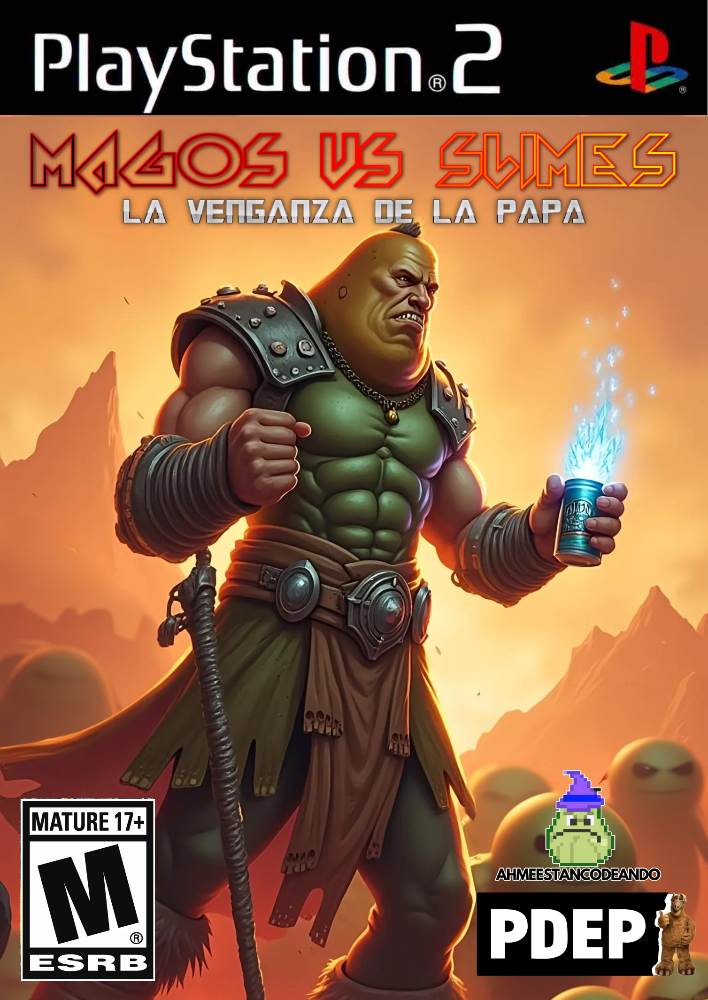
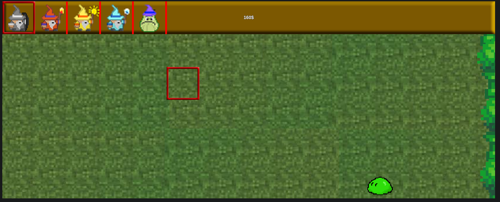

#  Magos Vs. Slime
UTN - Facultad Regional Buenos Aires - Materia Paradigmas de Programación

liveshare: https://prod.liveshare.vsengsaas.visualstudio.com/join?CE16CF3EFD993880D845E814408D13B910ED

## Equipo de desarrollo: 

- Echeverría, Manuel
- Marek, Nahuel
- Marzocca, Damián
- Schkurko, Nicolas
- Vallone, Matías
 

## Capturas 

## Reglas de Juego / Instrucciones

(completar...)

## Controles:

- `A` para ir a la izquierda en la tienda
- `D` para ir a la derecha en la tienda
- `ARROW_UP` para mover arriba cursor
- `ARROW_LEFT` para mover izquierda cursor
- `ARROW_RIGHT` para mover derecha cursor
- `ARROW_DOWN` para mover abajo cursor
- `ENTER` para poner planta
